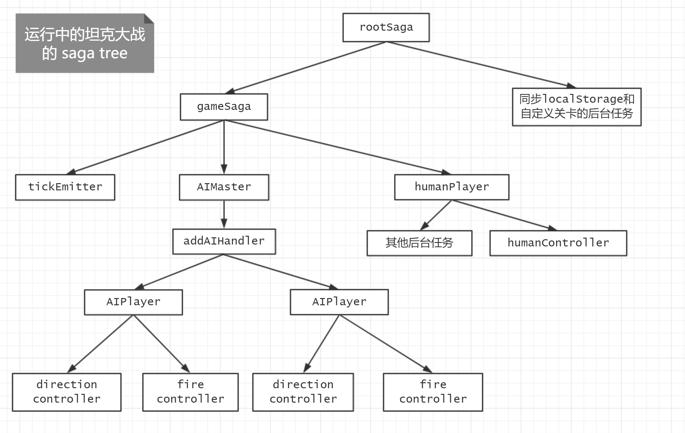
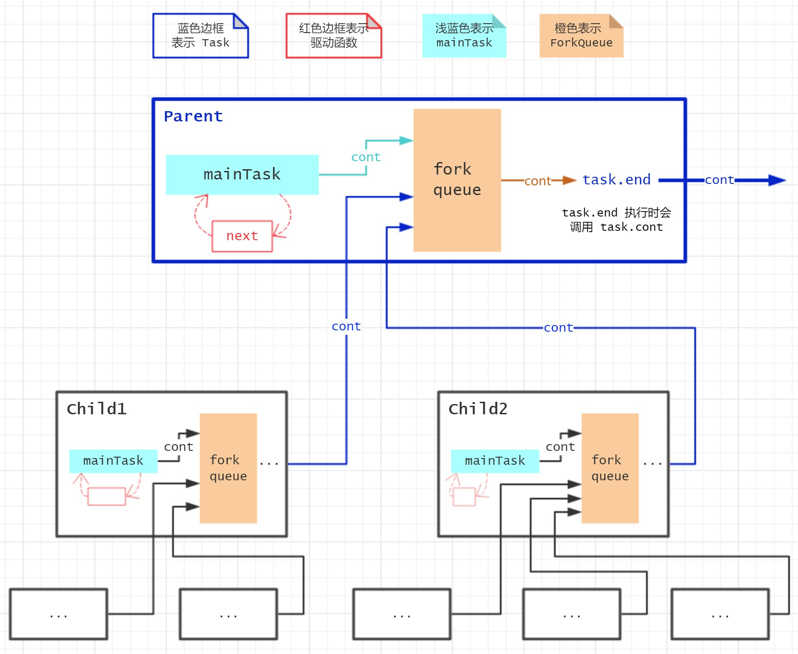

[](https://travis-ci.org/shinima/little-saga) [](https://coveralls.io/github/shinima/little-saga?branch=master) [](https://www.npmjs.org/package/little-saga)

# 构建你自己的 redux-saga

知乎上已经有不少介绍 redux-saga 的好文章了，例如 [redux-saga 实践总结](https://zhuanlan.zhihu.com/p/23012870)、[浅析 redux-saga 实现原理](https://zhuanlan.zhihu.com/p/30098155)、[Redux-Saga 漫谈](https://zhuanlan.zhihu.com/p/35437092)。本文将介绍 redux-saga 的实现原理，并一步步地用代码构建 little-saga —— 一个 redux-saga 的简单版本。希望通过本文，更多人可以了解到 redux-saga 背后的运行原理。

本文是对 redux-saga 的原理解析，将不再介绍 redux-saga 的相关概念。所以在阅读文章之前，请确保对 redux-saga 有一定的了解。

## 本文目录

* [0.1 文章结构](#01-%E6%96%87%E7%AB%A0%E7%BB%93%E6%9E%84)
* [0.2 名词解释](#02-%E5%90%8D%E8%AF%8D%E8%A7%A3%E9%87%8A)
* [0.3 关于 little-saga](#03-%E5%85%B3%E4%BA%8E-little-saga)
* [1.1 生成器函数](#11-%E7%94%9F%E6%88%90%E5%99%A8%E5%87%BD%E6%95%B0)
* [1.2 使用 while-true 来消费迭代器](#12-%E4%BD%BF%E7%94%A8-while-true-%E6%9D%A5%E6%B6%88%E8%B4%B9%E8%BF%AD%E4%BB%A3%E5%99%A8)
* [1.3 使用递归函数来消费迭代器](#13-%E4%BD%BF%E7%94%A8%E9%80%92%E5%BD%92%E5%87%BD%E6%95%B0%E6%9D%A5%E6%B6%88%E8%B4%B9%E8%BF%AD%E4%BB%A3%E5%99%A8)
* [1.4 双向通信](#14-%E5%8F%8C%E5%90%91%E9%80%9A%E4%BF%A1)
* [1.5 effect 的类型与含义](#15-effect-%E7%9A%84%E7%B1%BB%E5%9E%8B%E4%B8%8E%E5%90%AB%E4%B9%89)
* [1.6 result-first callback style](#16-result-first-callback-style)
* [1.7 cancellation](#17-cancellation)
* [1.8 effect 状态](#18-effect-%E7%8A%B6%E6%80%81)
* [1.9 proc 初步实现](#19-proc-%E5%88%9D%E6%AD%A5%E5%AE%9E%E7%8E%B0)
* [2.1 Task](#21-task)
* [2.2 fork model](#22-fork-model)
* [2.3 类 `ForkQueue`](#23-%E7%B1%BB-forkqueue)
* [2.4 task context](#24-task-context)
* [2.5 effect 类型拓展](#25-effect-%E7%B1%BB%E5%9E%8B%E6%8B%93%E5%B1%95)
* [2.6 little-saga 核心部分的完整实现](#26-little-saga-%E6%A0%B8%E5%BF%83%E9%83%A8%E5%88%86%E7%9A%84%E5%AE%8C%E6%95%B4%E5%AE%9E%E7%8E%B0)
* [2.7 Task 状态变化举例](#27-task-%E7%8A%B6%E6%80%81%E5%8F%98%E5%8C%96%E4%B8%BE%E4%BE%8B)
* [2.8 类 `Env`](#28-%E7%B1%BB-env)
* [3.1 commonEffects 拓展](#31-commoneffects-%E6%8B%93%E5%B1%95)
* [3.2 channelEffects 拓展](#32-channeleffects-%E6%8B%93%E5%B1%95)
* [3.3 compat 拓展](#33-compat-%E6%8B%93%E5%B1%95)
* [3.4 scheduler](#34-scheduler)
* [3.5 其他细节问题](#35-%E5%85%B6%E4%BB%96%E7%BB%86%E8%8A%82%E9%97%AE%E9%A2%98)

## 0.1 文章结构

本文很长，大致分为四部分。文中每一个章节有对应的 x.y 标记，方便相互引用。

* 0.x 介绍文章的一些相关信息。
* 1.x 讲解一些基础概念并实现一个简单版本的 proc 函数。
* 2.x 介绍 redux-saga/little-saga 的一些核心概念，例如 Task、fork model、effect 类型拓展，并实现了 little-saga 核心部分。
* 3.x 使用 little-saga 的拓展机制，实现了 race/all、channel、集成 redux 等功能，也讨论了一些其他相关问题。

## 0.2 名词解释

side effect 是来自函数式编程的概念，而 effect 这个单词直译过来是「作用」。「作用」是一个表意很模糊的词语，不太适合用在技术文章中，所以本文中将保持使用 effect 这个英文单词。不过，到底什么是 effect 呢？这又是一个很难解释清楚的问题。在本文中，我们放宽 effect 的概念，只要是被 yield 的值，都可以被称为 effect。例如 `yield 1` 中，数字 `1` 就是 effect，不过数字类型的 effect 缺少明确的含义；又例如 `yield fetch('some-url')` 中，`fetch('some-url')` 这个 Promise 对象便是 effect。

当我们使用 redux-saga 时，我们的业务代码往往充当 effect 的生产者：生成 effect，并使用 yield 语句将 effect 传给 saga-middleware。而 saga-middleware 充当 effect 的消费者：获取 effect，根据 effect 的类型解释该 effect，然后将结果返回给生产者。文中会使用 effect-producer 与 effect-runner 来表示生产者与消费者。注意 effect-runner 是需要将结果返回给 effect-producer 的，所以有的时候也需要将 redux-saga 看作一种「请求-响应」模型，我们业务代码生产 effect 以发起「请求」，而 saga-middleware 负责消费并将响应返回给业务代码。

saga 又是一个让人困扰的单词 (・へ・)，这里给一个简单的说明。文中的「saga 函数」其实就是指 JavaScript 生成器函数，不过特指那些「作为参数传入函数 proc 或 sagaMiddleware.run 然后开始运行」的生成器函数。「saga 实例」指的是调用 saga 函数得到的迭代器对象。task 指的是 saga 实例运行状态的描述对象。

## 0.3 关于 little-saga

little-saga 大量参考了 redux-saga 源码，参考的版本为 redux-saga v1.0.0-beta.1。redux-saga 对许多边界情况做了处理，代码比较晦涩，而 little-saga 则进行了大量简化，所以两者有许多实现细节差异。本文中出现的代码都是 little-saga 的，不过我偶尔也会附上相应的 redux-saga 源码链接，大家可以对照着看。

[little-saga](https://github.com/shinima/little-saga) 已经跑通了 redux-saga 的绝大部分测试（跳过了 little-saga 没有实现的那一部分功能的测试），使用 `little-saga/compat` 已经可以替换 redux-saga，例如我上次写的[坦克大战复刻版](https://zhuanlan.zhihu.com/p/35551654)就已经[使用 little-saga 替换掉了 redux-saga](https://github.com/shinima/battle-city/commit/e15d8bd5b9994f9f1af61c0bc16b58461ec9c33a)。

little-saga 的特点是没有绑定 redux，所以有的时候（例如写网络爬虫、写游戏逻辑时）如果并不想使用 redux，但仍想用 fork model 和 channel 来管理异步逻辑，可以尝试一下 little-saga。little-saga 的初衷还是通过简化 redux-saga，能让更多人理解 redux-saga 背后的原理。

## 1.1 生成器函数

让我们先从 redux-saga 中最常见的 yield 语法开始。生成器函数使用 `function*` 声明，而 yield 语法只能出现在生成器函数中。在生成器执行过程中，遇到 yield 表达式立即暂停，后续可恢复执行状态。使用 redux-saga 时，所有的 effect 都是通过 yield 语法传递给 effect-runner 的，effect-runner 处理该 effect 并决定什么时候恢复生成器。InfoQ 上面的[深入浅出 ES6（三）：生成器 Generators](http://www.infoq.com/cn/articles/es6-in-depth-generators) 是一篇非常不错的文章，对生成器不了解的话，非常推荐阅读该文。

调用生成器函数我们可以得到一个迭代器对象（关于迭代器的文章推荐[深入浅出 ES6（二）：迭代器和 for-of 循环](http://www.infoq.com/cn/articles/es6-in-depth-iterators-and-the-for-of-loop)）。在比较简单的情况下，我们使用 for-of 循环来「消费」该迭代器，下面的代码就是一个简单的例子。

```javascript
function* range(start, end) {
  for (let i = start; i < end; i++) {
    yield i
  }
}

for (let x of range(1, 10)) {
  console.log(x)
}
// 输出 1, 2, 3 ... 8, 9
```

for-of 虽然很方便，但是功能有限。迭代器对象包含了三个方法：next/throw/return，for-of 循环只会不断调用 next 方法；next 方法是可以带参数的，而 for-of 循环调用该方法都是不传参的。例如，for-of 循环就无法处理下面这样的生成器函数了。

```javascript
function* saga() {
  const someValue = yield ['echo', 3]
  // someValue 应该为 3，但使用 for-of循环的话，该值为 undefined

  yield Promise.reject(someError)
  // effectRunner 遇到 rejected Promise 应该使用迭代器的 throw 方法抛出 someError
  // 但使用 for-of 循环的话，无法调用迭代器的 throw 方法
}
```

## 1.2 使用 while-true 来消费迭代器

如果我们不用 for-of，而是使用 while-true 循环自己实现消费者，手动调用 next/throw/return 方法，那么我们可以实现更多的功能。下面的代码实现了一个「遇到数字 `5`就抛出错误」的 effec-runner。

```javascript
const iterator = range(1, 10)

while (true) {
  const { done, value } = iterator.next(/* 我们可以决定这里的参数 */)
  if (done) {
    break
  }
  if (value === 5) {
    iterator.throw(new Error('5 is bad input'))
  }
  console.log(value)
}
// 输出 1, 2, 3, 4，然后抛出异常 '5 is bad input'
```

然而，while-true 仍有一个缺陷：while-true 是同步的。这意味着生成器无法暂停执行直到某个异步任务（例如网络请求）完成，也就意味着无法使用 while-true 实现 redux-saga 了。

## 1.3 使用递归函数来消费迭代器

effect-runner 的最终答案是：递归函数。递归函数满足了作为一个 effect-runner 的所有要求，不仅能够调用迭代器的 next/throw/return 方法，能在调用这些方法时使用指定参数，还能同步或异步地调用它们。

上一个例子中我们所有的代码都是同步的；而在下面的例子中，如果我们发现 value 是偶数的话，我们不马上调用 next，而是使用 setTimeout 延迟调用 next。

```javascript
const iterator = range(1, 10)

function next() {
  const { done, value } = iterator.next()
  if (done) {
    return
  }
  console.log(value)
  if (value % 2 === 0) {
    setTimeout(next, value * 300)
  } else {
    next()
  }
}

next()
// 陆续输出 1, 2, 3 ... 8, 9
// 偶数数字输出之后，需要等待一会儿才会输出下一个奇数
// 奇数数字输出之后，立刻输出下一个偶数
```

这个例子比较简单，只是对 value 进行奇偶判断。不过我们不难设想以下的使用方法：effect-producer 产生 promise，而 effect-runner 对 promise 的处理方式如下：当 promise resolve 的时候调用迭代器 的 next 方法，当 promise reject 的时候调用迭代器的 throw 方法。我们就可以用生成器的语法实现 async/await，这也是生成器比 async/await 更加强大的原因。而 redux-saga/little-saga 不仅实现了对 promise 的处理，还实现了功能更为强大的 fork model。

在本文后面，我们称该递归函数为「驱动函数」。注意不要将驱动函数 next 和迭代器的 next 方法搞混，迭代器的 next 方法被调用的形式是 `iterator.next(someValue)`，而驱动函数被调用的形式不同。在 redux-saga/little-saga，函数名字为 `next` 的情况只有驱动函数和迭代器 next 方法这两种，所以如果发现一个叫做 `next` 的函数，且该函数不是迭代器方法，那么该函数就是驱动函数。

## 1.4 双向通信

前面的例子中，我们只用到了单项通信：effect-runner 调用 `iterator.next()` 获取 effect，但 effect-runner 并没有将数据传递给 effect-producer。在 redux-saga 中，我们往往需要使用 yield 语句的返回值，返回值的含义取决于 effect 的类型。例如下面这个例子：

```javascript
function* someSaga() {
  // yield 一个 promise 应该返回 promise resolve 的值
  const response = yield fetch('https://example.com/')
  // yield 一个 take effect 应该返回一个 Action
  const action = yield take('SOME_ACTION')
  // yield 一个 all effect 应该返回一个数组，该数组记录了 effect1 或 effect2 的执行结果
  const allResult = yield all([effect1, effect2])
}
```

为了实现双向通信，effect-runner 要提供合适的参数来调用 `iterator.next(arg)` 。当 `iterator.next(arg)` 被调用时，参数 arg 将会作为 `yield xxx` 语句的返回值，且暂停的迭代器会继续执行（直到遇到下一个 yield 语句）。为此我们修改前面的代码如下：

```javascript
function* range2(start, end) {
  for (let i = start; i < end; i++) {
    const response = yield i
    console.log(`response of ${i} is ${response}`)
  }
}

const iterator = range2(1, 10)

function next(arg, isErr) {
  // 注意驱动函数多了参数 arg 和 isErr
  let result
  if (isErr) {
    result = iterator.throw(arg)
  } else {
    // 这里我们将 arg 作为参数传递给 iterator.next，作为 effect-producer 中 yield 语句的返回值
    result = iterator.next(arg)
  }
  const { done, value } = result
  if (done) {
    return
  }
  console.log('getting:', value)
  if (value === 5) {
    // 将 isErr 置为 true，就能用递归的方式调用 iterator.throw 方法
    next(new Error('5 is bad input'), true)
  } else {
    // 延迟调用驱动函数；「响应」是「请求」的两倍
    setTimeout(() => next(value * 2), value * 1000)
  }
}
next()

// 输出
// getting: 1
// response of 1 is 2
// getting: 2
// response of 2 is 4
// getting: 3
// response of 3 is 6
// getting: 4
// response of 4 is 8
// getting: 5
// Uncaught Error: 5 is bad input

// 输出 getting: x 之后，输出会暂停一段时候
```

## 1.5 effect 的类型与含义

前面的例子中我们的 effect-producer 都是简单的 range，effect（即被 yield 的值）为数字。因为数字没有什么确切的含义，effect-runner 只是简单地打印这些数字，然后再在合适地时刻调用驱动函数。

如果 effect 有明确的含义，effect-runner 就可以根据其含义来决定具体的执行逻辑。redux-saga 可以处理 promise、iterator、take、put 等类型的 effect，合理地组合不同类型的 effect 可以表达非常复杂的异步逻辑。下面我们给 little-saga 加上一些简单的 effect 的处理能力，是不是觉得这个和 [co](https://github.com/tj/co) 很像呢？

```javascript
function* gen() {
  console.log('enter ...')
  const a = yield ['promise', fetch('/')]
  console.assert(a instanceof Response)
  const b = yield ['delay', 500]
  console.assert(b === '500ms elapsed')
  const c = yield ['ping']
  console.assert(c === 'pong')
  console.log('exit ... ')
}

const iterator = gen()

function next(arg, isErr) {
  let result
  if (isErr) {
    result = iterator.throw(arg)
  } else {
    result = iterator.next(arg)
  }
  const { done, value } = result
  if (done) {
    return
  }
  // 不打印 value，而是根据 value 的含义执行相应的处理逻辑
  if (value[0] === 'promise') {
    const promise = value[1]
    promise.then(resolvedValue => next(resolvedValue), error => next(error, true))
  } else if (value[0] === 'delay') {
    const timeout = value[1]
    setTimeout(() => next(`${timeout}ms elapsed`), timeout)
  } else if (value[0] === 'ping') {
    next('pong')
  } else {
    iterator.throw(new Error('无法识别的 effect'))
  }
}
next()
```

在 redux-saga 中，effect 是一个由[函数 effect](https://github.com/redux-saga/redux-saga/blob/v1.0.0-beta.1/packages/core/src/internal/io.js#L24) 生成、`[IO]` 字段为 `true` 的对象。little-saga 使用数组来表示 effect：数组的第一个元素为字符串，用于表示 effect 的类型，数组剩余元素为 effect 的参数。

前面几个小节介绍了 ES2015 生成器的特性，讲解了如何使用递归函数来实现 effect-runner。我们发现，约定一些常见的 effect 类型，并恰当使用这些类型的话，我们可以用生成器语法写出富有表达力的代码。

## 1.6 result-first callback style

在 Node.js 中，异步回调函数往往使用 error-first 的模式：第一个参数为 err，如果一个异步操作发生了错误，那么错误会通过 err 参数传递回来；第二个参数用于传递正确的操作结果，如果异步操作没有发生错误，那么操作结果会通过该参数进行传递。error-first 模式大量用于 node 核心模块（例如 [fs 模块](https://nodejs.org/dist/latest-v8.x/docs/api/fs.html)）和第三方库（例如 [async 模块](http://caolan.github.io/async/)），可以阅读[该文章](http://fredkschott.com/post/2014/03/understanding-error-first-callbacks-in-node-js/)了解更多信息。

而在 redux-saga/little-saga 中，我们使用 result-first 的模式。异步回调函数的第一个参数是操作结果，第二个参数是一个布尔值，表示是否发生了错误。我们称该风格为 result-first callback style，其类型信息用 TypeScript 表示如下：

```typescript
type Callback = (result: any, isErr: boolean) => void
```

redux-saga 源码中几乎所有回调函数都是该风格的，相应的变量名也有好几个：

* **cont** continuation 缩写，一般用于表示 Task / MainTask / ForkQueue 的后继
* **cb** callback 缩写 或是 **currCb** 应该是 currentCallback 的缩写。一般用于 effect 的后继/回调函数
* **next** 就是前边的递归函数，它也是符合 result-first callback style 的

redux-saga 中这些变量名频繁出现，仅在一个 proc.js 文件中就出现了几十次。在后面 little-saga 的代码中，我们都将使用该风格的回调函数。

## 1.7 cancellation

redux-saga 的一大特点就是 effects 是可取消的，并且支持使用 try-catch-finally 的语法将清理逻辑放在 finally 语句块中。官方文档中也对[任务取消](https://redux-saga.js.org/docs/advanced/TaskCancellation.html)做了说明。

在 redux-saga 具体实现中，调用者（caller）会将回调函数 cb 传递给被调用者（callee），当 callee 完成异步任务时，调用 cb 来把结果告诉给 caller。而 cancellation 机制是这么实现的：如果一个操作是可取消的话，callee 需要将「取消时的逻辑」放在 cb.cancel 上，这样一来当 caller 想要取消该异步操作时，直接调用 cb.cancel() 即可。函数调用是嵌套的，cb.cancel 的设置需要跟着函数调用一层层进行设置。在后面许多代码都会有类似 `cb.cancel = xxx` 的操作，这些操作都是在实现 cancellation。

文章[如何取消你的 Promise？](https://juejin.im/post/5a32705a6fb9a045117127fa)中也提到了多种取消 Promise 的方法，其中生成器是最具扩展性的方式，有兴趣的同学可以进行阅读。

## 1.8 effect 状态

effect 状态分为运行中、已完成（正常结束或是抛出错误结束都算完成）、被取消。

promise 一旦 resolve/reject 之后，就不能再改变状态了。effect 也是类似，一旦完成或是被取消，就不能再改变状态，「完成时的回调函数」和「被取消时的回调函数」合起来只能最多被调用一次。也就是说，effect 的「完成」和「被取消」是互斥的。

每一个 effect 在运行之前都会通过函数 `digestEffect` 的处理。该函用变量 `effectSettled` 记录了一个 effect 是否已经 settled，保证了上述互斥性。

`digestEffect` 也调用了 `normalizeEffect` 来规范化 effect，这样一来，对于 promise/iterator，我们可以在 effect-producer 直接 yield 这些对象，而不需要将它们包裹在数组中。

`digestEffect` 和 `normalizeEffect` 两个函数的代码如下：

```javascript
const noop = () => null
const is = {
  func: /* 判断参数是否函数 */
  string: /* 判断参数是否字符串 */
  /* ...... */
}

function digestEffect(rawEffect, cb) {
  let effectSettled = false

  function currCb(res, isErr) {
    if (effectSettled) {
      return
    }
    effectSettled = true
    cb.cancel = noop
    cb(res, isErr)
  }
  currCb.cancel = noop

  cb.cancel = () => {
    if (effectSettled) {
      return
    }
    effectSettled = true
    try {
      currCb.cancel()
    } catch (err) {
      console.error(err)
    }
    currCb.cancel = noop
  }

  runEffect(normalizeEffect(rawEffect), currCb)
}

// normalizeEffect 定义在其他文件
function normalizeEffect(effect, currCb) {
  if (is.string(effect)) {
    return [effect]
  } else if (is.promise(effect)) {
    return ['promise', effect]
  } else if (is.iterator(effect)) {
    return ['iterator', effect]
  } else if (is.array(effect)) {
    return effect
  } else {
    const error = new Error('Unable to normalize effect')
    error.effect = effect
    currCb(error, true)
  }
}
```

## 1.9 proc 初步实现

有了上面的基础，我们就可以初步实现 proc 函数了。所有 saga 实例都是通过该函数启动的，该函数是 redux-saga 中最重要的函数之一。

```javascript
const TASK_CANCEL = Symbol('TASK_CANCEL')
const CANCEL = Symbol('CANCEL')

function proc(iterator, parentContext, cont) {
  // 实际上task并不是这么构造的，不过在初步实现中，暂时先这样吧
  const task = {
    cancel: () => next(TASK_CANCEL),
  }
  // 设置cancel逻辑
  cont.cancel = task.cancel
  next()

  return task

  function next(arg, isErr) {
    try {
      let result
      if (isErr) {
        result = iterator.throw(arg)
      } else if (arg === TASK_CANCEL) {
        // next.cancel 由当前正在执行的 effectRunner 所设置
        next.cancel()
        result = iterator.return(TASK_CANCEL)
      } else {
        result = iterator.next(arg)
      }

      if (!result.done) {
        digestEffect(result.value, next)
      } else {
        // 迭代器执行完毕，调用cont将结果返回给上层
        cont(result.value)
      }
    } catch (error) {
      // 迭代器运行发生错误，调用cont将错误返回给上层
      cont(error, true)
    }
  }

  // function digestEffect(rawEffect, cb) { /* ...... */ }

  // 执行effect，根据effect的类型调用不同的effectRunner
  function runEffect(effect, currCb) {
    const effectType = effect[0]
    if (effectType === 'promise') {
      resolvePromise(effect, ctx, currCb)
    } else if (effectType === 'iterator') {
      resolveIterator(iterator, ctx, currCb)
    } else {
      // 拓展这里的 if-else 便可以拓展新的effect类型
      throw new Error('Unknown effect type')
    }
  }

  function resolvePromise([effectType, promise], ctx, cb) {
    const cancelPromise = promise[CANCEL]
    if (is.func(cancelPromise)) {
      // 设置promise的cancel逻辑
      cb.cancel = cancelPromise
    }
    promise.then(cb, error => cb(error, true))
  }

  function resolveIterator([effectType, iterator], ctx, cb) {
    proc(iterator, ctx, cb)
  }
}
```

## 2.1 Task

proc 函数（[redux-saga 的源码](https://github.com/redux-saga/redux-saga/blob/v1.0.0-beta.1/packages/core/src/internal/proc.js#L173)）用于运行一个迭代器，并返回一个 Task 对象。Task 对象描述了该迭代器的运行状态，我们首先来看看 Task 的接口（使用 TypeScript 来表示类型信息）。在 little-saga 中，我们将使用**类似**的 Task 接口。（注意是类似的接口，而不是相同的接口）

```typescript
type Callback = (result: any, isErr: boolean) => void
type Joiner = { task: Task; cb: Callback }

interface Task {
  cancel(): void
  toPromise(): Promise<any>

  result: any
  error: Error
  isRunning: boolean
  isCancelled: boolean
  isAborted: boolean
}
```

Task 对象包含了 `toPromise()` 方法，该方法会返回 saga 实例对应的 promise。`cancel()` 方法使得 saga 实例允许被取消；`isXXX` 等字段反映了 saga 实例的运行状态；`result` / `error` 字段可以记录了 saga 实例的运行结果。

async 函数被调用后，内部逻辑也许非常复杂，最后返回一个 Promise 对象来表示异步结果。而 saga 实例除了异步结果，还包含了额外的功能：「取消」以及「查询运行状态」。所以 Task 接口是要比 Promise 接口复杂的，内部实现也需要更多的数据结构和逻辑。

## 2.2 fork model

redux-saga 提供了 fork effect 来进行非阻塞调用，`yield fork(...)` 会返回一个 Task 对象，用于表示在后台执行的 saga 实例。在更普遍的情况下，一个 saga 实例在运行的时候会多次 yield fork effect，那么一个 parent-saga 实例就会有多个 child-saga。rootSaga 通过 `sagaMiddleware.run()` 开始运行，在 rootSaga 运行过程中，会 fork 得到若干个 child-saga，每一个 child-saga 又会 fork 得到若干个 grandchild-saga，如果我们将所有的 parent-child 关系绘制出来的话，我们可以得到类似于下图这样的一棵 saga 树。



redux-saga 的文档也对 fork model [进行了详细的说明](https://redux-saga.js.org/docs/advanced/ForkModel.html)，下面我做一点简单的翻译：

* 完成：一个 saga 实例在满足以下条件之后进入完成状态:

  1.  迭代器自身的语句执行完成
  2.  所有的 child-saga 进入完成状态

  **当一个节点的所有子节点完成时，且自身迭代器代码执行完毕时，该节点才算完成。**

* 错误传播：一个 saga 实例在以下情况会中断并抛出错误：

  1.  迭代器自身执行时抛出了异常
  2.  其中一个 child-saga 抛出了错误

  **当一个节点发生错误时，错误会沿着树向根节点向上传播，直到某个节点捕获该错误。**

* 取消：取消一个 saga 实例也会导致以下事情的发生：

  1.  取消 mainTask，也就是取消当前 saga 实例等待的 effect
  2.  取消所有仍在执行的 child-saga

  **取消一个节点时，该节点对应的整个子树都将被取消。**

## 2.3 类 `ForkQueue`

类 `ForkQueue` 是 fork model 的具体实现。redux-saga 使用了 [函数 forkQueue](https://github.com/redux-saga/redux-saga/blob/v1.0.0-beta.1/packages/core/src/internal/proc.js#L73) 来实现，在 little-saga 中我们使用 class 语法定义了 `ForkQueue` 类。

每一个 saga 实例可以用一个 Task 对象进行描述，为了实现 fork model，每一个 saga 实例开始运行时，我们需要用一个数组来保存 child-tasks。我们来看看 forkQueue 的接口：

```typescript
interface ForkQueue {
  constructor(mainTask: MainTask)
  addTask(task: Task): void
  cancelAll(): void
  abort(err: Error): void
}
```

ForkQueue 的构造函数接受一个参数 `mainTask`，该参数代表当前迭代器自身代码的执行状态，forkQueue.cont 会在 ForkQueue 被构造之后进行设置。当所有的 child-task 以及 mainTask 都完成时，我们需要调用 forkQueue.cont 来通知其 parent-saga（对应于 _2.2 fork model 中的「完成」_）。

ForkQueue 对象包含三个方法。方法 `addTask` 用于添加新的 child-task；方法 `cancelAll` 用于取消所有的 child-task；而方法 `abort` 不仅会取消所有的 child-task，还会调用 forkQueue.cont 向 parent-task 通知错误。

little-saga 的 ForkQueue 实现如下：

```javascript
class ForkQueue {
  tasks = []
  result = undefined
  // 使用 completed 变量来保证「完成」和「出错」的互斥
  completed = false

  // cont will be set after calling constructor()
  cont = undefined

  constructor(mainTask) {
    this.mainTask = mainTask
    // mainTask 一开始就会被添加到数组中
    this.addTask(this.mainTask)
  }

  // 取消所有的 child-task，并向上层通知错误
  abort(err) {
    this.cancelAll()
    this.cont(err, true)
  }

  addTask(task) {
    this.tasks.push(task)
    // 指定 child-task 完成时的行为
    task.cont = (res, isErr) => {
      if (this.completed) {
        return
      }

      // 移除 child-task
      remove(this.tasks, task)
      // 清空child-task完成时的行为
      task.cont = noop
      if (isErr) {
        // 某一个 child-task 发生了错误，调用 abort 来进行「错误向上传播」
        this.abort(res)
      } else {
        // 如果是 mainTask 完成的话，记录其结果
        if (task === this.mainTask) {
          this.result = res
        }
        if (this.tasks.length === 0) {
          // 满足了 task 完成的两个条件
          this.completed = true
          this.cont(this.result)
        }
      }
    }
  }

  cancelAll() {
    if (this.completed) {
      return
    }
    this.completed = true
    // 依次调用 child-task 的 cancel 方法，进行「级联向下取消」，并清空 child-task 完成时的行为
    this.tasks.forEach(t => {
      t.cont = noop
      t.cancel()
    })
    this.tasks = []
  }
}
```

## 2.4 task context

每一个 task 都有其对应的 context 对象，用于保存该 task 运行时的上下文信息。在 redux-saga 中我们可以使用 getContext/setContext 读写该对象。context 的一大特性是 child-task 会使用原型链的方式继承 parent-task context。当尝试访问 context 中的某个属性时，不仅会在当前 task context 对象中搜寻该属性，也会在 parent-task context 对象进行搜索，以及 parent-task 的 parent-task，依次层层往上搜索，直到找到该属性或是到达 rootSaga。该继承机制在 [redux-saga 中的实现](https://github.com/redux-saga/redux-saga/blob/v1.0.0-beta.1/packages/core/src/internal/proc.js#L194)也非常简单，只有一行代码：`const taskContext = Object.create(parentContext)`。

context 是一个强大的机制，例如在 React 中，React context 用途非常广泛，react-redux / react-router 等相关类库都是基于该机制实现的。然而在 redux-saga 中，context 似乎很少被提起。

在 little-saga 中，我们将充分利用 context 机制，并使用该机制实现「effect 类型拓展」、「连接 redux store」等功能。这些机制的实现会在本文后面提到。

## 2.5 effect 类型拓展

在 1.9 proc 初步实现中，函数 `runEffect` 遇到未知 effect 类型便会抛出异常。这里我们对该处做一些修改，以实现 effect 的类型拓展。当遇到未知的 effect 类型时，我们将使用 `ctx.translator` 的 `getRunner` 方法来获取该 effect 对应的 effectRunner，然后调用该 effectRunner。只要我们提前设置好 `ctx.translator`，就能在后续的代码中使用拓展类型。为了方便设置 `ctx.translator`，little-saga 中新增了 def 类型的 effect，用来关联拓展类型与其对应的 effectRunner。

根据 context 的特性，child-task 会继承 parent-saga 的 context，故在 parent-task 中定义的拓展类型也能用于 child-task。在 little-saga 中，race/all/take/put 等类型将使用该拓展机制进行实现。

```javascript
function runEffect(effect, currCb) {
  const effectType = effect[0]
  if (effectType === 'promise') {
    resolvePromise(effect, ctx, currCb)
  } else if (effectType === 'iterator') {
    resolveIterator(iterator, ctx, currCb)
  } else if (effectType === 'def') {
    runDefEffect(effect, ctx, currCb)
  /*   其他已知类型的 effect   */
  /*   ....................   */
  } else { // 未知类型的effect
    const effectRunner = ctx.translator.getRunner(effect)
    if (effectRunner == null) {
      const error = new Error(`Cannot resolve effect-runner for type: ${effectType}`)
      error.effect = effect
      currCb(error, true)
    } else {
      effectRunner(effect, ctx, currCb, { digestEffect })
    }
  }
}

function runDefEffect([_, name, handler], ctx, cb) {
  def(ctx, name, handler)
  cb()
}

// def 定义在其他文件
function def(ctx, type, handler) {
  const old = ctx.translator
  // 替换 ctx.translator
  ctx.translator = {
    getRunner(effect) {
      return effect[0] === type ? handler : old.getRunner(effect)
    }
  },
}
```

## 2.6 little-saga 核心部分的完整实现

little-saga 核心部分的实现代码位于 [/src/core](https://github.com/shinima/little-saga/tree/master/src/core) 文件夹内。完整实现的代码较多，相比于 _1.9 proc 初步实现_，完整实现添加了 context、task、fork model、effect 类型拓展、错误处理等功能，完善了 Task 生命周期（启动/完成/出错/取消）。

redux-saga 对应的实现代码全部都位于 proc.js 一个文件中，导致该文件很大；而 little-saga 则是将实现分成了若干个文件，下面我们一个一个来进行分析。

### 2.6.1 整体思路

在 2.6 后面的内容中，我们将使用以下的代码作为例子。该例子中，Parent 会 fork Child1 和 Child2，分别需要 100ms 和 300ms 来完成。Parent 迭代器本身的代码（mainTask）需要 200ms 完成。而整个 Parent Task 则需要 300ms 才能完成。

```javascript
function* Parent() {
  const Child1 = yield fork(api.xxxx) // LINE-1 需要 100ms 才能完成
  const Child2 = yield fork(api.yyyy) // LINE-2 需要 300ms 才能完成
  yield delay(200) // LINE-3 需要 200 ms 才能完成
}
```

下图展示了 Parent 运行时，各个 Task / mainTask / ForkQueue 之间的相互关系。图中的实线箭头表示两个对象之间的后继关系（cont）：「A 指向 B」意味着「当 A 完成时，需要将结果传递给 B」。

在 _1.7 cancellation_ 中我们知道 cancellation 的顺序和 cont 恰好是相反的，在具体代码实现时，我们不仅需要构建下图中的 cont 关系，还需要构建反向的 cancellation 关系。



本小节中的代码比较复杂，如果觉得理解起来比较困难的话，可以和 _2.7 Task 状态变化举例_ 对照着看。

### 2.6.2 函数 `proc`

函数 proc 是运行 saga 实例的入口函数。结合上图，函数 proc 的作用是创建图中各个 Task/mainTask 对象，并建立对象之间的后继关系（cont）和取消关系（cancellation）。代码如下：

```javascript
// /src/core/proc.js
function proc(iterator, parentContext, cont) {
  // 初始化当前 task 的 context
  const ctx = Object.create(parentContext)

  // mainTask 用来跟踪当前迭代器的语句执行状态
  const mainTask = {
    // cont: **will be set when passed to ForkQueue**
    isRunning: true,
    isCancelled: false,
    cancel() {
      if (mainTask.isRunning && !mainTask.isCancelled) {
        mainTask.isCancelled = true
        next(TASK_CANCEL)
      }
    },
  }

  // 创建 ForkQueue 对象和 Task 对象，这两个类的代码在后面会写出来
  const taskQueue = new ForkQueue(mainTask)
  const task = new Task(taskQueue)
  // 设置后继关系
  taskQueue.cont = task.end
  task.cont = cont

  // 设置取消关系
  cont.cancel = task.cancel
  next()

  return task

  // 以下代码均为函数定义

  // 在图中驱动函数只和 mainTask 有联系
  // 然后我们也可以发现下面 next 函数的代码中，也只调用了 mainTask 的接口
  // 即 next 函数中的代码不会引用 task 和 taskQueue 对象
  function next(arg, isErr) {
    console.assert(mainTask.isRunning, 'Trying to resume an already finished generator')

    try {
      let result
      if (isErr) {
        result = iterator.throw(arg)
      } else if (arg === TASK_CANCEL) {
        mainTask.isCancelled = true
        next.cancel() // 取消当前执行的 effect
        // 跳转到迭代器的 finally block，执行清理逻辑
        result = iterator.return(TASK_CANCEL)
      } else {
        result = iterator.next(arg)
      }

      if (!result.done) {
        digestEffect(result.value, next)
      } else {
        mainTask.isRunning = false
        mainTask.cont(result.value)
      }
    } catch (error) {
      if (!mainTask.isRunning) {
        throw error
      }
      if (mainTask.isCancelled) {
        // 在执行 cancel 逻辑时发生错误，在 3.4 其他问题与细节 中说明
        console.error(error)
      }
      mainTask.isRunning = false
      mainTask.cont(error, true)
    }
  }

  // function digestEffect(rawEffect, cb) { /* ...... */ }
  // function runEffect(effect, currCb) { /* ...... */ }

  // function resolvePromise([effectType, promise], ctx, cb) { /* ... */ }
  // function resolveIterator([effectType, iterator], ctx, cb) { /* ... */ }
  // ...... 各种内置类型的 effect-runner

  // fork-model 中新增了 fork/spawn/join/cancel/cancelled
  // 这五种类型的 effec-runner 代码见下方
}
```

### 2.6.3 fork-model 相关的 effect-runner

函数 `runForkEffect` 用来执行 fork 类型的 effect，并向调用者返回一个 subTask 对象。该函数需要注意的是，有的时候调用者会使用 fork 来执行一些同步的任务，所以调用 `proc(iterator, ctx, noop)` 可能会返回一个已经完成或是已经发生错误的 subTask，此时我们不需要将 subTask 放入 fork-queue 中，而是需要执行其他操作。

```javascript
// /src/core/proc.js
function runForkEffect([effectType, fn, ...args], ctx, cb) {
  const iterator = createTaskIterator(fn, args)
  try {
    suspend() // 见 3.4 scheduler
    const subTask = proc(iterator, ctx, noop)
    if (subTask.isRunning) {
      task.taskQueue.addTask(subTask)
      cb(subTask)
    } else if (subTask.error) {
      task.taskQueue.abort(subTask.error)
    } else {
      cb(subTask)
    }
  } finally {
    flush() // 见 3.4 scheduler
  }
}
```

剩下四个类型（spawn / join / cancel / cancelled）的 effect-runner 比较简单，这里就不再进行介绍。

### 2.6.4 类 `Task`

类 `Task` 是 *2.1 Task* 的具体实现。

```javascript
// /src/core/Task.js
class Task {
  isRunning = true
  isCancelled = false
  isAborted = false
  result = undefined
  error = undefined
  joiners = []

  // cont will be set after calling constructor()
  cont = undefined

  constructor(taskQueue) {
    this.taskQueue = taskQueue
  }

  // 调用 cancel 函数来取消该 Task，这将取消所有当前正在执行的 child-task 和 mainTask
  // cancellation 会向下传播，意味着该 Task 对应的 saga-tree 子树都将会被取消
  // 同时 cancellation 也会传递给该 Task 的所有 joiners
  cancel = () => {
    // 如果该 Task 已经完成或是已经被取消，则跳过
    if (this.isRunning && !this.isCancelled) {
      this.isCancelled = true
      this.taskQueue.cancelAll()
      // 将 TASK_CANCEL 传递给所有 joiners
      this.end(TASK_CANCEL)
    }
  }

  // 结束当前 Task
  // 设置 Task 的 result/error，然后调用 task.cont，最后将结果传递给 joiners
  // 当该 Task 的 child-task 和 mainTask 都完成时（即 fork-queue 完成时），该函数将被调用
  end = (result, isErr) => {
    this.isRunning = false
    if (!isErr) {
      this.result = result
    } else {
      this.error = result
      this.isAborted = true
    }

    this.cont(result, isErr)
    this.joiners.forEach(j => j.cb(result, isErr))
    this.joiners = null
  }

  toPromise() {
    // 获取 task 对应的 promise 对象，这里省略了代码
  }
}
```

### 2.6.5 小节

这一节中代码较多，而且代码的逻辑密度很高。想要完全理解 little-saga 的实现思路，还是需要仔细阅读源代码才行。

## 2.7 Task 状态变化举例

下面的代码是 2.6 中的例子。

```javascript
function* Parent() {
  const Child1 = yield fork(api.xxxx) // LINE-1 需要 100ms 才能完成
  const Child2 = yield fork(api.yyyy) // LINE-2 需要 300ms 才能完成
  yield delay(200) // LINE-3 需要 200 ms 才能完成
}
```

下表展示了这个例子在一些关键时间点的执行情况与相应的状态变化。注意在下表中，如果没有指定 task/forkQueue/mainTask 是属于 Parent 还是 Child1/Child2，默认都是属于 Parent 的。下表只展示了这个例子正常完成的过程，我们也可以思考一下在 t=50 / t=150 / t=250 / t=350 等不同时间点，如果 Parent 被取消了，代码又会怎么执行。

| 时间点 | 事件            | 状态变化                                                    |
| ------ | --------------- | ----------------------------------------------------------- |
| t=0    | Parent 开始运行 | Parent 的 task 被创建，且 mainTask 被添加到 forkQueue 中    |
| t=0    | LINE-1 执行     | Task Child1 被创建，且被添加到 forkQueue 中                 |
| t=0    | LINE-2 执行     | Task Child2 被创建，且被添加到 forkQueue 中                 |
| t=0    | LINE-3 执行     | 驱动函数执行 `result = iterator.next(arg)`                  |
|        |                 | 此时 result 为 delay(200) 对应的 promise effect             |
|        |                 | 驱动函数间接调用 resolvePromise 来执行该 effect             |
|        |                 | next.cancel 被 resolvePromise 设置为取消定时器              |
| t=100  | Child1 完成     | Child1.cont 被调用；Child1 从 forkQueue 中被移除            |
|        |                 | forkQueue 中仍存在 Child2 与 mainTask                       |
| t=200  | delay(200) 完成 | mainTask.cont 被调用；**mainTask.isRunning 被设置为 false** |
|        |                 | forkQueue.result 记下了 mainTask 的结果                     |
|        |                 | mainTask 从 forkQueue 中被移除；forkQueue 中还剩下 Child2   |
| t=300  | Child2 完成     | Child2.cont 被调用；Child2 从 forkQueue 中被移除            |
|        |                 | forkQueue 变为空，forkQueue.cont（也就是 task.end) 被调用   |
|        | task.end 被调用 | **task.isRunning 被设置为 false**                           |
|        |                 | task.result 被设置为 forkQueue.result                       |
|        |                 | **task.cont 被调用，Parent 进入完成状态**                   |
|        |                 | task.joiners 被唤醒                                         |

## 2.8 类 `Env`

类 `Env` 的作用是在运行 rootSaga 之前，对 root Task 的运行环境进行配置。Env 采用了链式调用风格的 API，方便将多个配置串联起来。

我们可以利用 Env 来预先添加一些常见的 effect 类型，例如 all/race/take/put 等，这样后续所有的 saga 函数都可以直接使用这些 effect 类型。例如下面的代码在运行 rootSaga 之前定义了 delay 和 echo 两种 effect。

```javascript
new Env()
  .def('delay', ([_, timeout], _ctx, cb) => setTimeout(cb, timeout))
  .def('echo', ([_, arg], _ctx, cb) => cb(arg))
  .run(rootSaga)

function* rootSaga() {
  yield ['delay', 500] // 500ms之后 yield 才会返回
  yield ['echo', 'hello'] // yield 返回字符串 'hello'
}
```

## 2.9 第二部分小节

至此，little-saga 的核心部分实现完毕。核心部分实现了 fork model，实现了 fork/join/cancel/promise/iterator 等内置类型的 effect-runner，并预留了拓展接口。第三部分中，我们将使用该拓展接口来实现 redux-saga 中剩下的那些 effect 类型（all/race/put/take 等）。

## 3.1 commonEffects 拓展

all-effect 的行为与 Promise#all 非常类似：all-effect 在构造时接受一些 effects 作为 sub-effects，当所有 sub-effects 完成时，all-effect 才算完成；当其中之一 sub-effect 抛出错误时，all-effect 会立即抛出错误。

有了 def effect，拓展 effect 就简单多了。redux-saga 中 [runAllEffect](https://github.com/redux-saga/redux-saga/blob/v1.0.0-beta.1/packages/core/src/internal/proc.js#L616) 用于运行 all 类型的 effect，我们拷贝该代码，并简单修改，使其符合 effectRunner 接口，即可在 little-saga 中实现 all effect。little-sage 中实现 all effect 的代码如下：

```javascript
// 这里该函数是一个简化版，省略了 all-effect 被取消的处理代码
// 这里假设 effects 是一个对象，实际版本中还需要考虑 effects为数组的情况
function all([_, effects], ctx, cb, { digestEffect }) {
  const keys = Object.keys(effects)

  let completedCount = 0
  const results = {}
  const childCbs = {}

  keys.forEach(key => {
    const chCbAtKey = (res, isErr) => {
      if (isErr || res === TASK_CANCEL) {
        // 其中一个 sub-effect 发生错误时，立刻调用 cb 来结束 all-effect
        cb.cancel()
        cb(res, isErr)
      } else {
        results[key] = res
        completedCount++
        if (completedCount === keys.length) {
          cb(results)
        }
      }
    }
    childCbs[key] = chCbAtKey
  })

  keys.forEach(key => digestEffect(effects[key], childCbs[key]))
}
```

race 和其他一些常见的 effect 也是通过相同的方式实现的。`little-saga/commonEffects` 提供了 7 种来自 redux-saga 的常用类型拓展，包括：all / race / apply / call / cps / getContext / setContext。当我们想要在代码中使用这些类型时，我们可以使用 Env 来加载 commonEffects：

```javascript
import { Env, io } from 'little-saga'
import commonEffects from 'little-saga/commonEffects'

// 调用 use(commonEffects) 之后，就能在代码中使用 commonEffects 提供的拓展类型了
new Env().use(commonEffects).run(function* rootSaga() {
  yield io.race({
    foo: io.cps(someFunction),
    foo: io.call(someAPI),
  })
})
```

## 3.2 channelEffects 拓展

`little-saga/channelEffects` 提供了 5 种和 channel 相关的类型拓展（take / takeMaybe / put / actionChannel / flush），并从 redux-saga 拷贝了 channel / buffers 的代码。

`env.use(channelEffects)` 不仅会添加类型拓展，还会在 ctx.channel 上设置一个默认 channel。当使用 put/take effect 时，如果没有指定 channel 参数，则默认使用 ctx.channel。

使用 little-saga 中的 channel，可以实现任意两个 Task 之间的通信。不过 channel 又是一个很大的话题，本文就不再详细介绍了。channel 相关源码的可读性相当不错，欢迎直接[阅读源码](https://github.com/shinima/little-saga/tree/master/src/channelEffects)。

## 3.3 compat 拓展

compat 拓展使得 little-saga 可以和 redux 进行集成，并提供与 redux-saga 一致的 API。不过 little-saga 因为 normalizedEffect 的关系，无法和其他 redux 中间件（例如 redux-thunk）共存，最终是无法完全兼容 redux-saga API 的。

little-saga 的 `createSagaMiddleware` 也是比较有意思的一个函数，其实现思路如下：首先使用 channelEffects 添加 channel 相关拓展；然后用 store.dispatch 替换掉 ctx.channel.put，这样一来 put effect 会转换为对 dispatch 函数的调用；另一方面，`createSagaMiddleware` 返回一个 redux 中间件，该中间件会将所有的 action（回想一下，redux 中 action 只能来自于 dispatch）put 回原来的 channel 中，这样所有 action 又能够重新被 take 到了；当然，中间件也使用了 getState 来实现 select effect。代码如下：

```javascript
function createSagaMiddleware(cont) {
  function middleware({ dispatch, getState }) {
    let channelPut
    const env = new Env(cont)
      .use(commonEffects)
      .use(channelEffects)
      .use(ctx => {
        // 记录「真实」的 channel.put
        channelPut = ctx.channel.put

        // 使用 dispatch 替换掉 channel 上的 put 方法
        ctx.channel.put = action => {
          action[SAGA_ACTION] = true
          dispatch(action)
        }

        // 使用 def 方法来定义 select 类型的 effect-runner
        def(ctx, 'select', ([_effectType, selector = identity, ...args], _ctx, cb) =>
          cb(selector(getState(), ...args)),
        )
      })

    // 当 middleware 函数执行时，说明 store 正在创建
    // 此时我们给 middleware.run 设置正确的函数
    middleware.run = (...args) => env.run(...args)

    return next => action => {
      const result = next(action) // hit reducers
      // 下面的 if-else 主要是为了保证 channelPut(action) 恰好被包裹在一层 asap 中
      // asap 的介绍见 3.4
      if (action[SAGA_ACTION]) {
        // SAGA_ACTION 字段为 true 表示该 action 来自 saga
        // 而在 saga 中，我们在 put 的时候已经使用了函数asap
        // 所以在这里就不需要再次调用 asap 了
        channelPut(action)
      } else {
        // 表示该 action 来自 store.dispatch
        // 例如某个 React 组件的 onClick 中调用了 dispatch 方法
        asap(() => channelPut(action))
      }
      return result
    }
  }

  middleware.run = (...args) => {
    throw new Error('运行 Saga 函数之前，必须使用 applyMiddleware 将 Saga 中间件加载到 Store 中')
  }

  return middleware
}
```

## 3.4 scheduler

asap / suspend / flush 是来自于 scheduler.js 的方法。asap 被用在 put effect 中，而后面两个函数被用在 fork/spawn effect 中。

scheduler 主要是处理 「嵌套 put」问题。考虑下面的代码，rootSaga 会 fork genA 和 genB，genA 会先 put-A 然后 take-B，而 genB 会先 take-A 然后 put-B。

```javascript
function* rootSaga() {
  yield fork(genA) // LINE-1
  yield fork(genB) // LINE-2
}

function* genA() {
  yield put({ type: 'A' })
  yield take('B')
}

function* genB() {
  yield take('A')
  yield put({ type: 'B' })
}
```

在**使用** scheduler 的情况下，这两次 take 都是可以成功的，即 genA 可以 take 到 B，而 genB 可以 take 到 A，这也是所我们期望的情况。

假设在**不使用** scheduler 的情况下，put-A 唤醒了 take-A。因为这里的 put/take 的执行都是同步的，所以 take-A 被唤醒之后执行的下一句是 genB 中的 put-B，而此时 genA 还处于执行 put-A 的状态，genA 将丢失 B。也就是说在**不使用** scheduler 的情况下，嵌套的 put 很有可能导致部分 action 的丢失。

使用函数 asap 包裹 put 的过程，可以保证「内层的 put」延迟到「外层的 put 执行结束时」才开始执行，从而避免嵌套 put。asap 是 as soon as possible 的缩写，`asap(fn)` 的意思可以理解为「当外层的 asap 任务都执行完之后，尽可能快地执行 fn」。

我们再考虑上面代码中的 LINE-1 和 LINE-2，在**不使用** scheduler 的情况下，这两行代码的前后顺序会影响运行结果：因为默认 channel 用的是 multicastChannel，multicastChannel 没有缓存（buffer），所以为了能够成功 take-A，take-A 必须在 put-A 之前就开始执行。

使用函数 suspend/flush 包裹 fork/spawn 的过程，可以保证「fork/spawn 中的同步 put」延迟到「fork/spawn 执行结束时」才开始执行。这样一来，take-A 总是能比 put-A 先执行，LINE-1 和 LINE-2 的前后顺序就不会影响运行结果了。

## 3.5 其他细节问题

本小节记录了 redux-saga/little-saga 中仍存在的一些细节问题，不过这些问题在平时编程中较为少见，影响也不大。

Task 的「取消」和「完成」是互斥的。Task 被取消时代码会直接跳转进入 finally 语句块，但此时仍有可能发生错误，即发生了「执行 cancel 逻辑时发生错误」的现象。此时 Task 的状态已经为「被取消」，我们不能将 task 的状态修改为「完成（出错）」。对于这类错误，little-saga 只是简单地使用 console.error 进行了打印，并没有较为优雅的处理方式。所以我们在使用 redux-saga/little-saga 写代码的时候，尽量避免过于复杂的 cancel 逻辑，以防在 cancel 逻辑中发生错误。

当一个往 channel 中 put 一个 END 的时候，正在 take 该 channel 的该怎么办？[redux-saga 中的处理比较奇怪](https://github.com/redux-saga/redux-saga/blob/v1.0.0-beta.1/packages/core/src/internal/proc.js#L301-L303)，我询问了一下作者，他表示这是一个用在服务端渲染的 hack。而 little-saga 中做了简化，如果 take 得到了 END，那么就将 END 看作是 TASK_CANCEL。

有很多内容本文没有提到，例如「调用迭代器的 throw/return 方法时代码的执行顺序」，「异常的捕获与处理」等。另外，redux-saga 的源码中也有多处用 TODO 进行了标记，所以还有许多问题等待这去解决。

## 3.6 总结

fork model 是一个非常优秀的异步逻辑处理模型，在阅读 redux-saga 源码和测试，进而实现 little-saga 的过程中，我也学到了非常多新知识。如果大家有什么问题或建议的话，欢迎一起探讨。
